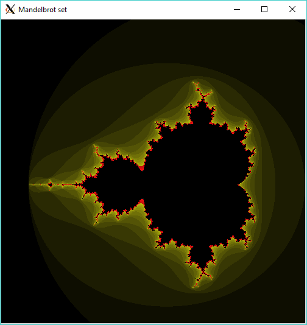

# Homework

## Ulam spiral

Prints ulam spiral with marked primes to the console, adapted to it's width and height.

## Random walk

Walker walks randomly long distances in 8 directions and repeatedly marks visited cell with color. The programm ends when the walker reaches some end of the screen.

## Circle rainbow

Creates P6 PNM image file with circle rainbow.

## Mandelbrot set

Creates a window with statically render mandelbrot set.

## Cyclic list

The goal is to print ulam spiral with marked primes in the console adapted to it's width and height.

