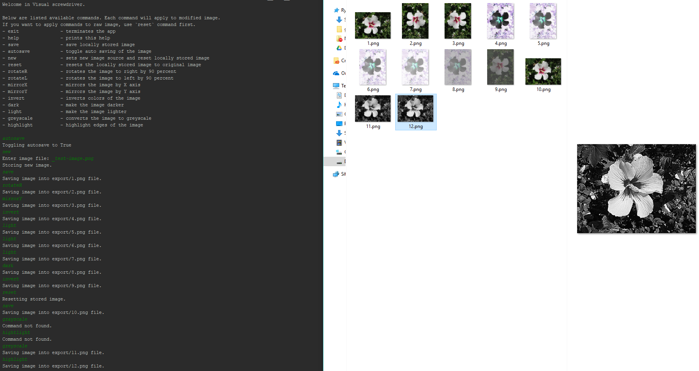

# Semestral work

## Assignment (in Czech)

Výstupem semestrální práce bude aplikace napsaná v Python'u 3.x, která dokáže načíst vstupní obrázek a na něm provádět přinejmenším následující grafické operace:

* základní geometrické modifikace – převrácení obrazu, …;
* inverzní obraz;
* převod do odstínů šedi;
* zesvětlení/ztmavení;
* zvýraznění hran;
* …

Přitom na načtení (a případné uložení) obrázků můžete použít (a asi i použijete :-) metody knihovny Pillow, na zpracování operací však nikoli! Všechny operace budou napsané „ručně“ pomocí Numpy (plus případné optimalizace pomocí Numby či Cythonu), abyste se ho naučili používat. (Samozřejmě že jsou už dávno x-krát naprogramované v několika dalších dostupných knihovnách, a to optimalizovaně a rychle, ale to by nebyla taková zábava ;-)

Co se aplikace týká, může to být buď klasické GUI (tkinter není podmínkou, klidně si to pište třeba v Qtéčku), v kterémžto případě očekávám u prováděných operací vizuální odezvu nad zpracovávaným obrázkem, nebo konzolová aplikace, v kterémžto případě zase musí obsahovat velmi podrobnou nápovědu, jak se má používat (což se naštěstí v Python'u píše zrovna docela snadno).

## Screenshot

